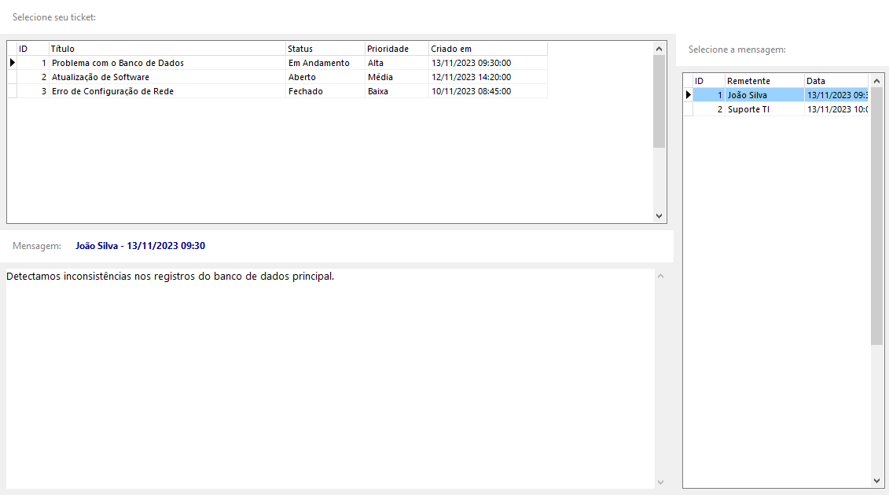

# Tickets Viewer

A modern ticket management and visualization application built with Delphi VCL.

## Features

- 📋 View and manage support tickets
- 💬 Read ticket messages and conversations
- 🎨 Modern and responsive interface
- 🔍 Easy ticket navigation
- 📱 Clean and intuitive design

## Getting Started

### Prerequisites

- Windows operating system
- SQLite support (included in the release)

### Installation

1. Download the latest release from the [Releases page](https://github.com/Jekzx/Tickets-viewer/releases)
2. Extract the ZIP file to your desired location
3. Run `TicketsViewer.exe`

## Usage

1. Launch the application
2. Browse through tickets in the main grid
3. Click on a ticket to view its messages
4. Select a message to view its full content

## Sample Data

The application comes with pre-populated sample data including:
- Support tickets with various priorities and statuses
- Sample conversations and messages
- Realistic ticket scenarios

## Development

### Built With

- Delphi VCL
- FireDAC Components
- SQLite Database

### Development Setup

1. Clone the repository
2. Open the project in Delphi
3. Ensure you have the required components:
   - FireDAC
   - SQLite driver

## Contributing

Contributions are welcome! Please feel free to submit a Pull Request.

## License

This project is licensed under the MIT License - see the [LICENSE](LICENSE) file for details.

## Author

- **Jekzx** - [GitHub Profile](https://github.com/Jekzx)

## Acknowledgments

- Thanks to everyone who has contributed to making this project better
- Special thanks to the Delphi community for their support
